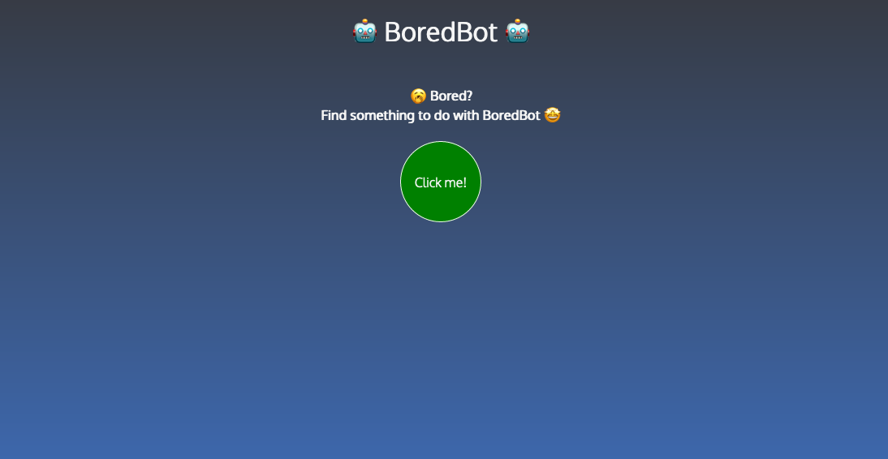

# BoredBot

## Overview

A bot that gives you a random activity to do when you're bored. Created as part of [Scrimba.com's Front-End Career Path](https://scrimba.com/learn/frontend).

## Built with
- HTML
- CSS
- JavaScript 

## Screenshot

## Connect

Thank you for reading about this project. If you'd like to connect with me for mentoring, collaboration, or employment opportunities, you can do so via the following links:

- [Email](https://anthonynanfito.com/contact/)
- [LinkedIn](https://linkedin.com/in/anthonynanfito)
- [Portfolio](https://ananfito.github.io)
- [Blog](https://ananfito.hashnode.dev)

Happy Coding!
